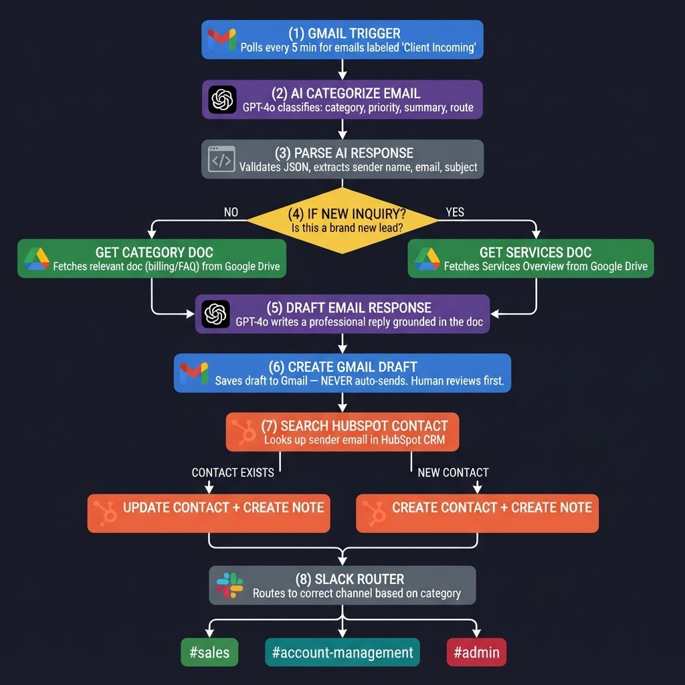
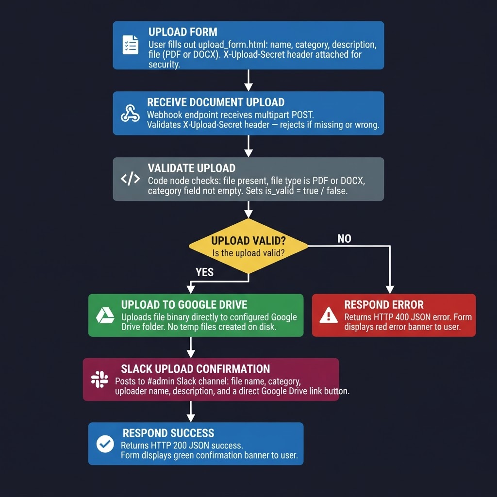

# AI Email Triage — Automation Template

**Built with n8n · Python · OpenAI GPT-4o · Gmail · Google Drive · HubSpot · Slack**

*An automation template for service-based businesses that receive high volumes of client email.*

---

## What This Template Does

Automatically triages incoming client emails using AI.
For every new email received:

1. **Classifies** it into a category (new inquiry, client support, billing, escalation) and priority level using GPT-4o
2. **Retrieves** the most relevant internal document from Google Drive to ground the reply
3. **Drafts** a professional, document-grounded response and saves it to Gmail Drafts — **never auto-sends**
4. **Logs** the interaction to HubSpot, creating or updating the contact record
5. **Notifies** the correct Slack channel with a triage summary and HubSpot link

> ⚠️ **No email is ever sent automatically.** Every draft requires a human to review and send manually.

---

## Who This Is For

This template is designed for **service-based businesses** that:

- Receive a steady volume of client emails across multiple categories (inquiries, support, billing, escalations)
- Have internal documentation (SOPs, FAQs, service overviews) they want to use as the basis for replies
- Use HubSpot as their CRM and Slack for internal team communication
- Want AI assistance with drafting without removing humans from the sending decision

Typical use cases: consulting firms, agencies, managed service providers, professional services teams.

---

## Files in This Repository

| File | Purpose |
|------|---------|
| `apex_email_triage.json` | Importable n8n workflow — drag into n8n via Workflows → Import |
| `apex_email_triage.py` | Standalone Python equivalent — runs without n8n (see note below) |
| `apex_doc_upload.json` | n8n webhook workflow for the Document Ingestion Portal |
| `apex_doc_upload.py` | Python Flask server equivalent for the Document Ingestion Portal |
| `upload_form.html` | Branded HTML form for document uploads |
| `.env.example` | Template for environment variables (copy to `.env`, never commit) |
| `README.md` | This file |

---

> **Note on the Python implementation:** `apex_email_triage.py` has been syntax-validated and all dependencies verified. End-to-end testing requires a **local Python environment** with a browser available for the one-time Google OAuth flow. Google's OAuth2 implementation does not support headless server environments (such as Google Cloud Shell) for Desktop app credentials. The n8n workflow (`apex_email_triage.json`) is the **production-tested implementation**. The Python file is provided as a developer reference and portfolio companion.

## Architecture — AI Email Triage



### Option A — n8n Setup

1. Import `apex_doc_upload.json` via Workflows → Import
2. Open the **Receive Document Upload** node and copy the Production webhook URL
3. Open `upload_form.html` and replace `YOUR_WEBHOOK_URL_HERE` with the copied URL
4. Configure Google Drive OAuth2 and Slack OAuth2 credentials
5. **Activate the workflow** before testing — webhook URLs only work when active
6. Open `upload_form.html` in a browser and test with a sample PDF

### Option B — Python Setup

```bash
# Install additional dependency
pip install flask

# Run the server
python apex_doc_upload.py

# Open your browser at:
# http://localhost:5678
```

Set `WEBHOOK_URL` in `upload_form.html` to `http://localhost:5678/webhook/upload-document` for local testing.

### Accepted File Types
- PDF (`.pdf`)
- Word Document (`.docx`)

### Document Categories
| Form Label | Internal Value |
|------------|---------------|
| Services Overview | `services` |
| Billing & Admin | `billing` |
| Client Support FAQ | `faq` |
| Compliance SOP | `compliance` |
| Vendor Management | `vendor` |
| Other | `other` |

### Security
The webhook is protected by a **shared secret header** (`X-Upload-Secret`). Every request from the form includes this header. The server rejects anything that doesn't match.

**To configure:**
1. Generate a secret: `python -c "import secrets; print(secrets.token_hex(32))"`
2. Add `UPLOAD_SECRET=<your-secret>` to your `.env` file
3. Replace `UPLOAD_SECRET_HERE` in `upload_form.html` with the same value

For full production security, host the form behind an identity provider (Cloudflare Access, Google IAP) so only authenticated users can load the page at all.

---

---

## Document Ingestion Portal

The Document Ingestion Portal adds a self-service web form that lets team members upload new internal documents directly into the Google Drive knowledge base — without needing direct Drive access. Uploaded files are immediately available to the AI Email Triage workflow as reference material.

### Files

| File | Purpose |
|------|---------|
| `apex_doc_upload.json` | Importable n8n webhook workflow |
| `apex_doc_upload.py` | Python Flask server — same logic, no n8n required |
| `upload_form.html` | Branded HTML upload form |

### Architecture — Document Ingestion Portal



### Option A — n8n Setup

1. Import `apex_doc_upload.json` via Workflows → Import
2. Open the **Receive Document Upload** node and copy the Production webhook URL
3. Open `upload_form.html` and replace `YOUR_WEBHOOK_URL_HERE` with the copied URL
4. Configure Google Drive OAuth2 and Slack OAuth2 credentials
5. **Activate the workflow** before testing — webhook URLs only work when active
6. Open `upload_form.html` in a browser and test with a sample PDF

### Option B — Python Setup

```bash
# Install additional dependency
pip install flask

# Run the server
python apex_doc_upload.py

# Open your browser at:
# http://localhost:5678
```

Set `WEBHOOK_URL` in `upload_form.html` to `http://localhost:5678/webhook/upload-document` for local testing.

### Accepted File Types
- PDF (`.pdf`)
- Word Document (`.docx`)

### Document Categories

| Form Label | Internal Value |
|------------|---------------|
| Services Overview | `services` |
| Billing & Admin | `billing` |
| Client Support FAQ | `faq` |
| Compliance SOP | `compliance` |
| Vendor Management | `vendor` |
| Other | `other` |

### Security

The webhook is protected by a **shared secret header** (`X-Upload-Secret`). Every request from the form includes this header. The server rejects anything that doesn't match.

**To configure:**
1. Generate a secret: `python -c "import secrets; print(secrets.token_hex(32))"`
2. Add `UPLOAD_SECRET=<your-secret>` to your `.env` file
3. Replace `UPLOAD_SECRET_HERE` in `upload_form.html` with the same value

For full production security, host the form behind an identity provider (Cloudflare Access, Google IAP) so only authenticated users can load the page at all.

---

## Versioning

| Version | Description |
|---------|-------------|
| v1 | AI Email Triage — classify, draft, log to HubSpot, notify Slack |
| v2 | Document Ingestion Portal — upload docs to Google Drive via web form |

---

*This template is maintained as a neutral starting point for service-based businesses. Replace all placeholder credentials, document IDs, and channel names before production use.*
